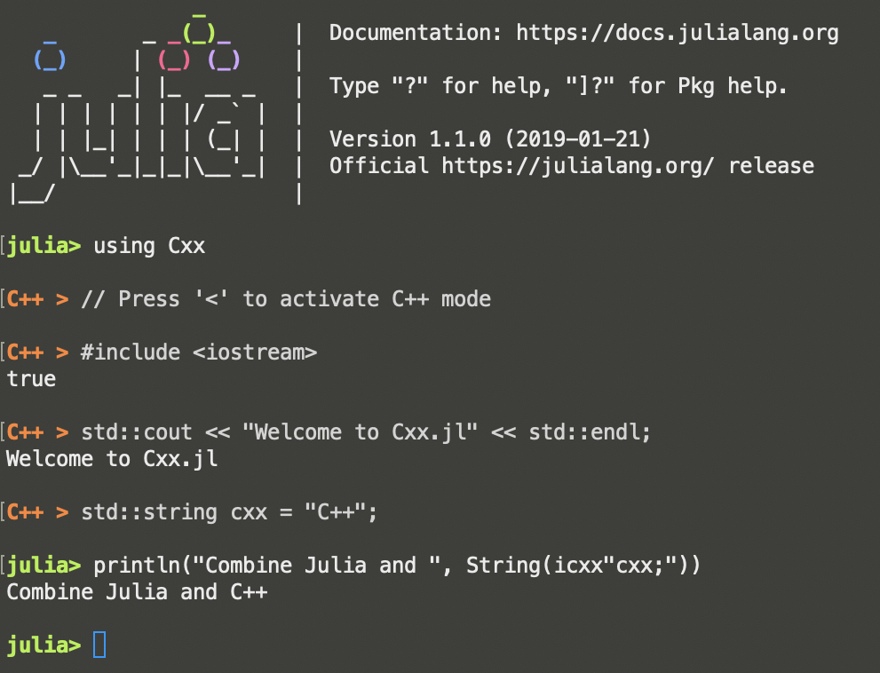

## Cxx.jl

[](https://travis-ci.org/JuliaInterop/Cxx.jl)
[](https://ci.appveyor.com/project/JuliaInterop/cxx-jl/branch/master)
[](https://codecov.io/gh/JuliaInterop/Cxx.jl)
[](https://JuliaInterop.github.io/Cxx.jl/stable)
[](https://JuliaInterop.github.io/Cxx.jl/dev)

The Julia C++ Foreign Function Interface (FFI) and REPL.




### Installation
Now, this package provides an out-of-box installation experience on all 64-bit ["Tier 1"](https://julialang.org/downloads/#support-tiers) platforms for Julia 1.1.
```
pkg> add Cxx
```
Note that Windows support is still in its early stage, so feel free to submit feedback in the issue tracker.

### Build from source
#### Build requirements

In addition to the [system requirements](https://github.com/JuliaLang/julia#required-build-tools-and-external-libraries) to build julia itself, the following are required:

- *Debian/Ubuntu*: `libedit-dev`, `libncurses5-dev`
- *RedHat/CentOS*: `libedit-devel`

#### Building Cxx

Launch Julia (version 1.0 or later), and in the terminal type
```julia
pkg> build Cxx
```

### How it works

The main interface provided by Cxx.jl is the @cxx macro. It supports two main usages:

  - Static function call
      @cxx mynamespace::func(args...)
  - Membercall (where m is a CppPtr, CppRef or CppValue)
      @cxx m->foo(args...)

To embed C++ functions in Julia, there are two main approaches:

```julia
# Using @cxx (e.g.):   
cxx""" void cppfunction(args){ . . .} """ => @cxx cppfunction(args)

# Using icxx (e.g.):
julia_function (args) icxx""" *code here*  """ end
```    

### The C++ REPL

This package contains an experimental C++ REPL feature. Using the package
will automatically add a new pane to your REPL that is accessible by pressing the
`<` key.

### **Using Cxx.jl:**

#### Example 1: Embedding a simple C++ function in Julia

```julia
# include headers
julia> using Cxx
julia> cxx""" #include<iostream> """  

# Declare the function
julia> cxx"""  
         void mycppfunction() {   
            int z = 0;
            int y = 5;
            int x = 10;
            z = x*y + 2;
            std::cout << "The number is " << z << std::endl;
         }
      """
# Convert C++ to Julia function
julia> julia_function() = @cxx mycppfunction()
julia_function (generic function with 1 method)

# Run the function
julia> julia_function()
The number is 52
```

#### Example 2: Pass numeric arguments from Julia to C++

```julia
julia> jnum = 10
10

julia> cxx"""
           void printme(int x) {
              std::cout << x << std::endl;
           }
       """

julia> @cxx printme(jnum)
10
```

#### Example 3: Pass strings from Julia to C++
 ```julia
julia> cxx"""
          void printme(const char *name) {
             // const char* => std::string
             std::string sname = name;
             // print it out
             std::cout << sname << std::endl;
          }
      """

julia> @cxx printme(pointer("John"))
    John
```

#### Example 4: Pass a Julia expression to C++

```julia
julia> cxx"""
          void testJuliaPrint() {
              $:(println("\nTo end this test, press any key")::Nothing);
          }
       """

julia> @cxx testJuliaPrint()
       To end this test, press any key
```

#### Example 5: Embedding C++ code inside a Julia function

```julia
function playing()
    for i = 1:5
        icxx"""
            int tellme;
            std::cout<< "Please enter a number: " << std::endl;
            std::cin >> tellme;
            std::cout<< "\nYour number is "<< tellme << "\n" <<std::endl;
        """
    end
end
playing();
```
#### Example 6: Using C++ enums

```julia
julia> cxx"""
       class Klassy {
           public:
               enum Foo { Bar, Baz };
               static Foo exec(Foo x) { return x; }
       };
       """
# Access enum
julia> @cxx Klassy::Bar
CppEnum{Symbol("Klassy::Foo")}(0)

# Pass enum as an argument
julia> @cxx Klassy::exec(@cxx(Klassy::Baz))
CppEnum{Symbol("Klassy::Foo")}(1)
```
#### Example 7: C++ Hello World class
```julia
julia> using Cxx
julia> cxx"""#include <iostream>
       class Hello
       {
           public:
               void hello_world(const char *now){
                   std::string snow = now;
                   std::cout << "Hello World! Now is " << snow << std::endl;
               }
        };"""
julia> hello_class = @cxxnew Hello()
julia> tstamp = string(Dates.now())
julia> @cxx hello_class -> hello_world(pointer(tstamp))
Hello World! Now is 2015-06-19T11:20:31

```

#### Example 8: Using C++ with shared libraries

ArrayMaker.h
```c++
#ifndef ARRAYMAKER_H
#define ARRAYMAKER_H

class ArrayMaker
{
    private:
        int iNumber;
        float fNumber;
        float* fArr;
    public:
        ArrayMaker(int, float);
        float* fillArr();
};

#endif
```

ArrayMaker.cpp
```c++
#include "ArrayMaker.h"
#include <iostream>

using namespace std;

ArrayMaker::ArrayMaker(int iNum, float fNum) {
    cout << "Got arguments: " << iNum << ", and " << fNum << endl;
    iNumber = iNum;
    fNumber = fNum;
    fArr = new float[iNumber];
}

float* ArrayMaker::fillArr() {
    cout << "Filling the array" << endl;
    for (int i=0; i < iNumber; i++) {
        fArr[i] = fNumber;
        fNumber *= 2;
    }
    return fArr;
}
```

Compiling into shared library
```
>> g++ -shared -fPIC ArrayMaker.cpp -o libArrayMaker.so
```

Using in Julia
```julia

julia> using Cxx

# Importing shared library and header file
julia> const path_to_lib = pwd()
julia> addHeaderDir(path_to_lib, kind=C_System)
julia> Libdl.dlopen(path_to_lib * "/libArrayMaker.so", Libdl.RTLD_GLOBAL)
Ptr{Cvoid} @0x000000000728e6d0
julia> cxxinclude("ArrayMaker.h")

# Creating class object
julia> maker = @cxxnew ArrayMaker(5, 2.0)
Got arguments: 5, and 2
Cxx.CppPtr{Cxx.CppValue{Cxx.CppBaseType{:ArrayMaker},(false,false,false)},(false,false,false)}(Ptr{Cvoid} @0x00000000060ab570)

julia> arr = @cxx maker->fillArr()
Filling the array

julia> pointer_to_array(arr, 5)
5-element Array{Float32,1}:
  2.0
  4.0
  8.0
 16.0
 32.0
```

### Troubleshooting

#### Replacement the current compiler instance

As of now Cxx.jl does not allow redefinition of a function. In order to allow defining the same function multiple times the current compiler instance can be replaced by typing

```julia
__current_compiler__ = Cxx.new_clang_instance()
```
